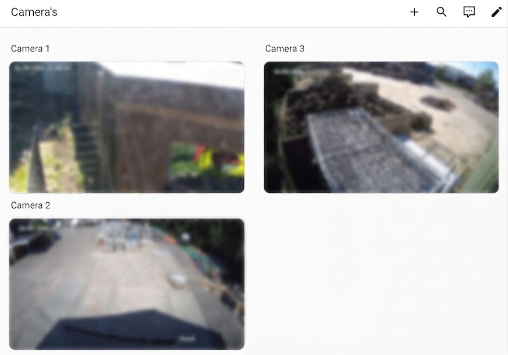
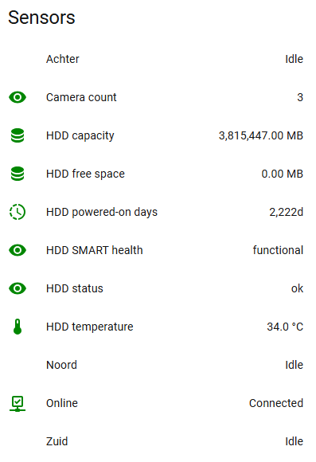
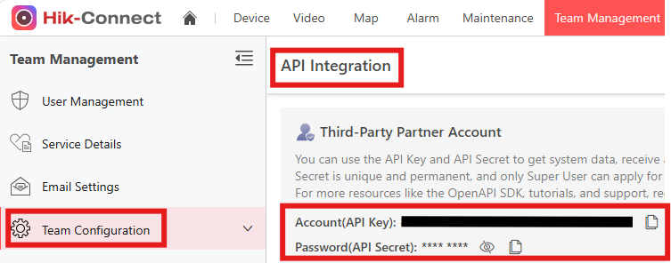

# Hik-Connect NVR

Hik-Connect NVR is a custom Home Assistant integration for Hikvision NVRs and
cameras connected through Hik-Connect. It creates normal Home Assistant camera
entities and read-only NVR-health sensors without requiring direct access to
the NVR's local network.

This is useful when cameras sit on the NVR's PoE network and are reachable only
through Hik-Connect.

> Community software. It is not affiliated with, endorsed by, or supported by
> Hikvision.

## Features

- One `camera` entity for every camera available to the Hik-Connect API.
- Main stream (HD) or sub stream (SD) selection during setup.
- NVR online state, camera count and available HDD health data.
- Direct cloud-to-Home-Assistant HLS streaming: no App, proxy, container or
  local NVR connection required.
- Read-only operation. It does not change NVR settings, expose the NVR publicly,
  archive recordings, run AI analysis or register webhooks.

### Home Assistant dashboard

 

## Requirements

- A current, supported Home Assistant installation.
- A Hikvision NVR and cameras that are available in Hik-Connect.
- A **Hikvision Developer Account**. Register as a **Technology Partner** in
  the [Hikvision Technology Partner Portal (TPP)](https://tpp.hikvision.com/tpp/Company/TPPRegister).
- An AppKey and SecretKey issued to that account for the appropriate Hik-Connect
  or Hik-Partner Pro OpenAPI product.

Hikvision's formal developer-account process is called Technology Partner Portal
(TPP) registration. It requires review and approval before OpenAPI credentials
can be issued. A normal Hik-Connect username and password cannot be used here.

Keep the AppKey and SecretKey private. Home Assistant stores them in the local
integration entry; they are not included in diagnostics.

After API Integration is enabled for your Hik-Connect team, open
[Hik-Connect Portal](https://www.hik-connect.com/views/login/index.html#/portal)
→ **Team Management → Team Configuration → API Integration** to copy the
Account (API Key) and Password (API Secret).

## Installation

This integration is not in the default HACS store yet. Add it as a custom
repository:

1. Open HACS and go to **Integrations**.
2. Open **⋮ → Custom repositories**.
3. Add `https://github.com/Frens98/hikconnect-nvr` with category **Integration**.
4. Download **Hik-Connect NVR** and restart Home Assistant.
5. Go to **Settings → Devices & services → Add integration** and search for
   **Hik-Connect NVR**.

## Configuration

Enter the AppKey and SecretKey from your Hikvision Developer Account, then choose
the stream you configured on the NVR:

| Integration choice | Configure in the NVR as |
| --- | --- |
| **Main stream (HD)** | Main stream, standard H.264 |
| **Sub stream (SD)** | Sub stream, standard H.264 |

The integration uses Hikvision's HLS OpenAPI route. Hikvision limits that route
to standard H.264, so H.264+ and H.265/HEVC cannot be used for these streams.
This is a Hikvision HLS limitation, not a Home Assistant decoder setting; the
integration does not transcode video.

Start with 10-15 fps. Choose the bitrate in the NVR based on resolution, scene
detail and available network capacity.

## Dashboard cards

Use the normal Home Assistant camera cards. Set `camera_view: live` when you
want continuous HLS video. Home Assistant's `auto` mode is its periodically
refreshed thumbnail mode, rather than the live HLS player.

## Support and contributing

Open an issue or pull request if you can help improve the integration. Please
redact logs and never include an AppKey, SecretKey, access token, device serial
number or temporary stream URL. Do not add proprietary Hikvision documentation
or captured API traffic to this repository.
